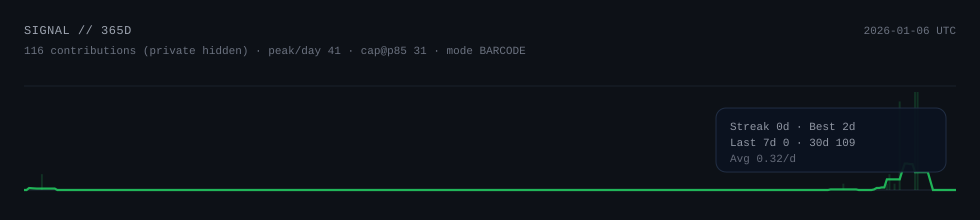

&nbsp;&nbsp;&nbsp;
<a href="https://github.com/Naveenkumar-026?tab=repositories">⬡&nbsp;PROJECTS</a>
&nbsp;&nbsp;·&nbsp;&nbsp;
<a href="https://github.com/Naveenkumar-026?tab=stars">★&nbsp;STARRED</a>
&nbsp;&nbsp;&nbsp;

<em>&ldquo;Not everything here is meant to be understood on first pass.&rdquo;</em>

